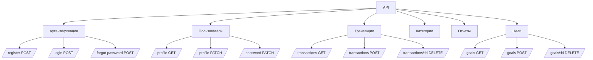
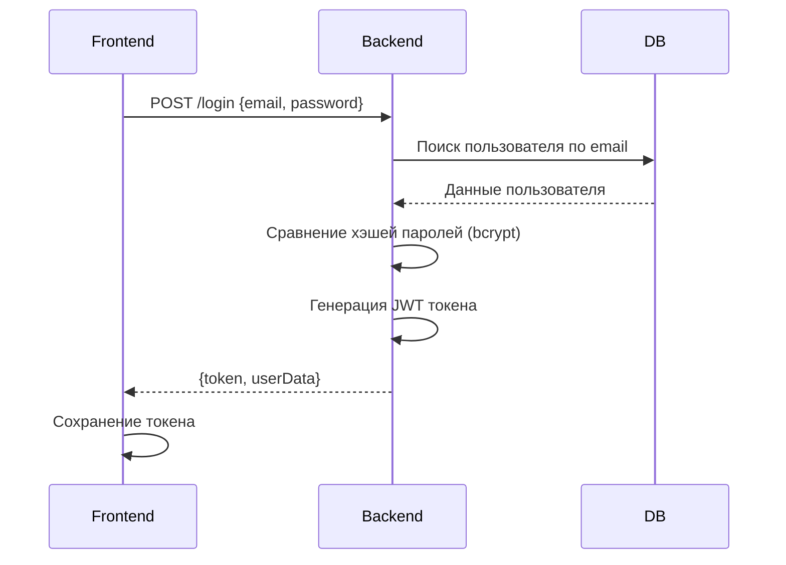
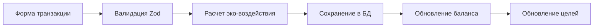
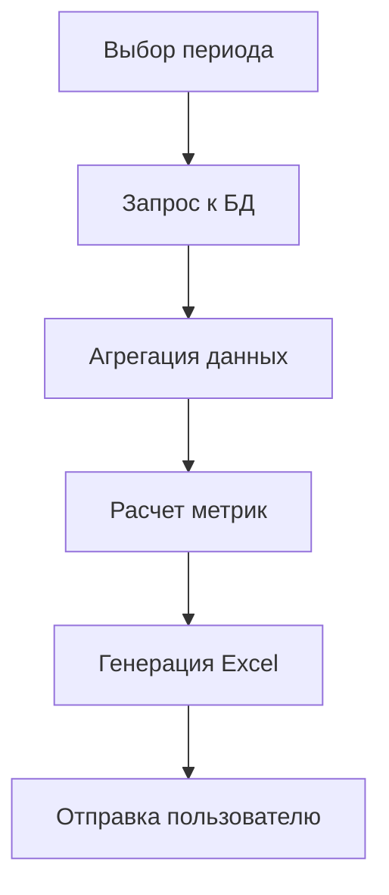

# Документация приложения EcoFinance

### Общее описание
EcoFinance — это веб-приложение для управления личными финансами с фокусом на экологическом воздействии расходов. Платформа позволяет:
- Отслеживать доходы и расходы
- Анализировать финансовую статистику
- Ставить финансовые цели
- Оценивать углеродный след расходов
- Формировать детальные отчеты
- Сравнивать экологическое воздействие различных категорий трат

### Технологический стек
```
Frontend:
├── React (UI библиотека)
├── TypeScript (статическая типизация)
├── Vite (сборка и разработка)
├── Tailwind CSS (стилизация)
├── Shadcn/ui (UI компоненты)
├── TanStack Query (управление состоянием)
├── Chart.js (визуализация данных)
└── Wouter (роутинг)

Backend:
├── Express.js (веб-фреймворк)
├── PostgreSQL (база данных)
├── Drizzle ORM (работа с БД)
├── Zod (валидация данных)
├── Bcrypt (шифрование паролей)
├── JWT (аутентификация)
└── XLSX (генерация Excel отчетов)

Инфраструктура:
├── Dotenv (переменные окружения)
├── Date-fns (работа с датами)
└── Nodemon (автоперезагрузка сервера)
```

### Архитектура приложения
```

├── client/           # Фронтенд
│   ├── src/          # Исходники
│   │   ├── pages/    # Страницы приложения
│   │   ├── components/ # UI компоненты
│   │   ├── lib/      # Вспомогательные модули
|   |   ├── hooks/    # Хуки React
│   │   └── ...
│   └── index.html    # Точка входа
│
├── server/           # Бэкенд
│   ├── routes.ts # API эндпоинты
│   ├── storage.ts # Работа с БД
│   ├── vite.ts   # Настройка Vite
│   └── index.ts  # Запуск сервера
│   └── ...
│
├── shared/           # Общий код
│   └── schema.ts     # Схемы БД и валидации
│
└── ...
```

### Детализация модулей

#### 1. Фронтенд-страницы
**`landing.tsx`** - Публичная страница:
- Описание возможностей приложения
- Призывы к регистрации
- Преимущества платформы
- Адаптивный дизайн
  
**`dashboard.tsx`** - Главная страница после входа:
- Отображает ключевые метрики: баланс, доходы, расходы
- Показывает последние транзакции
- Визуализирует финансовый прогресс
- Отображает эко-рейтинг пользователя
- Предоставляет быстрый доступ к основным функциям

**`transactions.tsx`** - Управление транзакциями:
- Таблица всех операций
- Фильтрация по типам и категориям
- Добавление новых транзакций
- Удаление операций
- Визуальные иконки категорий

**`goals.tsx`** - Управление целями:
- Создание финансовых целей
- Отслеживание прогресса
- Визуализация сбережений
- Рекомендации по достижению целей

**`profile.tsx`** - Интерфейс для управления персональными данными, настройками безопасности и учетной записью.
- Редактирование личной информации
- Смена пароля
- Управление настройками приложения
- Удаление аккаунта
- Просмотр статистики активности

**`reports.tsx`** - Аналитика и отчеты:
- Фильтрация по месяцам/годам
- Круговые диаграммы распределения расходов
- Excel-экспорт отчетов
- Анализ экологического воздействия

#### 2. Бэкенд-модули
**`routes.ts`** - API эндпоинты:


**`storage.ts`** - Работа с базой данных:
- Реализация CRUD операций
- Расчет финансовой статистики
- Генерация отчетов
- Вычисление эко-метрик
- Прогресс по целям

**`index.ts`** - Ядро сервера:
- Инициализация Express
- Настройка middleware
- Обработка ошибок
- Логирование запросов
- Интеграция с Vite в разработке

#### 3. Общие модули
**`schema.ts`** - Центральный модуль данных:
- Схемы таблиц БД (Drizzle ORM)
- Валидация данных (Zod)
- TypeScript-типы
- Реляционные связи

Пример структуры:
```typescript
export const users = pgTable("users", {
  id: serial("id").primaryKey(),
  email: text("email").notNull().unique(),
  password: text("password").notNull(),
  // ... другие поля
});

export const insertUserSchema = createInsertSchema(users).pick({
  email: true,
  password: true,
  firstName: true,
  lastName: true,
});
```

### Ключевые функции приложения

#### 1. Финансовый трекинг
- Регистрация доходов/расходов по категориям
- Автоматический расчет баланса
- Визуализация финансового потока
- Ежемесячные сравнения

#### 2. Экологический мониторинг
- Расчет углеродного следа для каждой транзакции
```typescript
// Расчет эко-воздействия
switch (category) {
  case "transport":
    ecoImpact = amount * 0.2; // 0.2 кг CO2 на рубль
    break;
  case "food":
    ecoImpact = amount * 0.15;
    break;
  // ... другие категории
}
```
- Персональный эко-рейтинг (A+, A, B и т.д.)
- Рекомендации по снижению воздействия

#### 3. Целеполагание
- Установка финансовых целей
- Отслеживание прогресса
- Визуализация сбережений
- Автоматические рекомендации

#### 4. Отчетность
- Готовые шаблоны отчетов
- Визуализация данных (графики, диаграммы)
- Excel-экспорт
- Сравнение периодов

### Принципы работы

#### Аутентификация


#### Работа с транзакциями


#### Формирование отчетов


### Экологическая модель
Приложение использует упрощенную модель расчета углеродного следа:
1. Каждой категории назначен коэффициент воздействия
2. Расчет: `Сумма * Коэффициент = CO2 в кг`
3. Пример коэффициентов:
   - Транспорт: 0.2 кг/рубль
   - Коммунальные услуги: 0.25 кг/рубль
   - Еда: 0.15 кг/рубль
   - Развлечения: 0.05 кг/рубль

Рейтинговая система:
- A+: < 50 кг CO2/месяц
- A: 50-100 кг
- B: 100-200 кг
- C: 200-500 кг
- D: > 500 кг

### Особенности реализации

1. **Real-time обновления**:
   - Автоматическое обновление данных каждые 10 секунд
   - Инвалидация кэша React Query

2. **Адаптивный дизайн**:
   - Mobile-first подход
   - Гибкие сетки Tailwind
   - Адаптивные карточки

3. **Безопасность**:
   - JWT аутентификация
   - Хэширование паролей (bcrypt)
   - Валидация всех входных данных

4. **Производительность**:
   - Код-сплиттинг Vite
   - Ленивая загрузка компонентов
   - Оптимизированные SQL-запросы


EcoFinance представляет собой современное решение для управления финансами с уникальным фокусом на экологической ответственности. Приложение сочетает мощные аналитические инструменты с простым пользовательским интерфейсом, делая управление финансами интуитивно понятным и социально ответственным процессом.

Архитектура проекта обеспечивает масштабируемость и поддерживает дальнейшее развитие функционала, а использование современных технологий гарантирует высокую производительность и безопасность данных пользователей.
